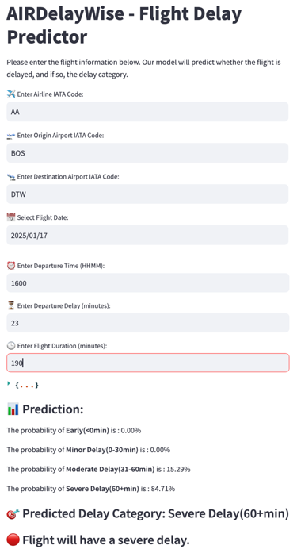
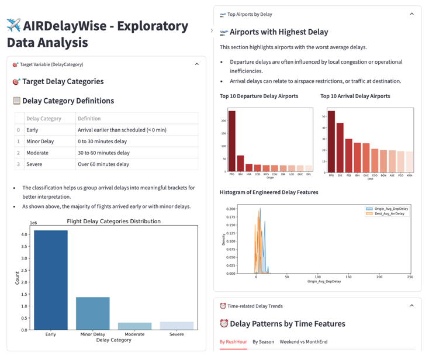
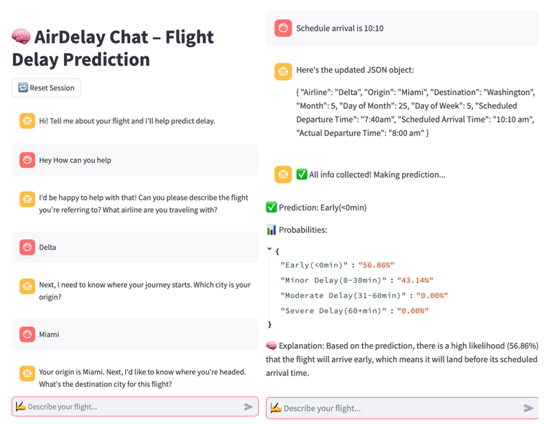

# ✈️ Flight Delay Prediction & LLM-Based Chatbot
This project predicts flight delay categories using historical and real-time data. It also features an interactive chatbot powered by a local LLM to support natural language flight queries. The app is built with Streamlit, integrates batch and streaming pipelines via Azure, and offers explainable model outputs.

## ‼️Prerequisite
1. Ollama needs to be installed and configured locally in advance.

    - **Reference Link**: [Ollama Installation Tutorial](https://www.cnblogs.com/obullxl/p/18295202/NTopic2024071001)

2. If you want to change the model, please change `def query_ollama_chat()` in **llm_dialogue_2.py** accordingly.
    
    [library (ollama.com)](https://ollama.com/library) is the ollama model library, please search for the model you need and launch it before running this project.

    - **Reference Link**: [Ollama GitHub](https://github.com/ollama/ollama)

## 🔍 Features Overview

### Part 1: Prediction Interface
- User inputs flight details (airline, airports, datetime, etc.)
- Model returns delay category and probability distribution in real-time

### Part 2: Exploratory Data Analysis (EDA)
- Delay category distribution
- Histograms of numerical features
- Average arrival delays per airline
- Most delayed airports
- Delay trends by time-related features

### Part 3: LLM-Based Flight Chatbot
- Users can describe flights in natural language
- The system extracts structured information (slots) through LLM
- If information is incomplete, follow-up questions are generated
- The final prediction is explained to the user

### 📂 Directory and Function Description
project/
│
├── models/                             # Model-related files
│   ├── best_model.pt                   # Trained PyTorch model
│   ├── embedding_dims.json             # Embedding dimensions for categorical features
│   └── label_encoders.json             # LabelEncoder encoding information
│
├── src/                                # Core code modules
│   ├── init.py
│   ├── utils.py                        # Contains several helper functions for data preprocessing, feature creation, and encoding processing
│   ├── model.py                        # Contains model definition and loading codes, as well as prediction functions
│   ├── feature_engineering_1.py        # Feature construction logic
│   ├── llm_dialogue_2.py               # Multi-turn LLM dialogue slot extraction logic
│   └── model_utils_3.py                # Model loading + prediction + explanation functions
│
├── data/                               # Supporting data
│   ├── lookup_dicts.pkl                # Average delay time mapping dictionary
│   └── airports_timezone.csv           # IATA ↔️ City ↔️ Timezone mapping table
│
├── mapping/                            # Visualization, statistical data
│   ├── airline_avg_arr_delay.csv
│   ├── airline_avg_dep_delay.csv
│   ├── dest_avg_arr_delay.csv
│   └── origin_avg_dep_delay.csv
│
├── venv/                               # Virtual environment
│
├── app.py                              # Streamlit application
├── requirements.txt                    # All dependencies
└── README.md                           # Project description

